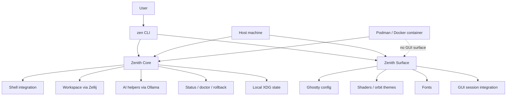
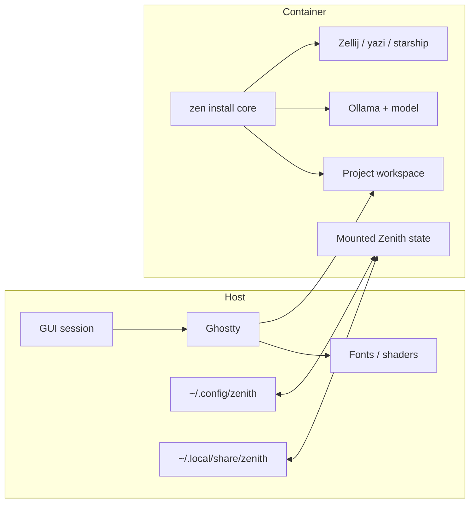
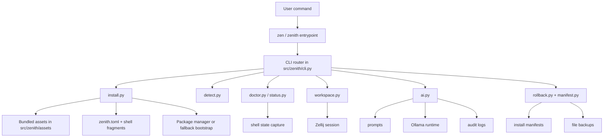
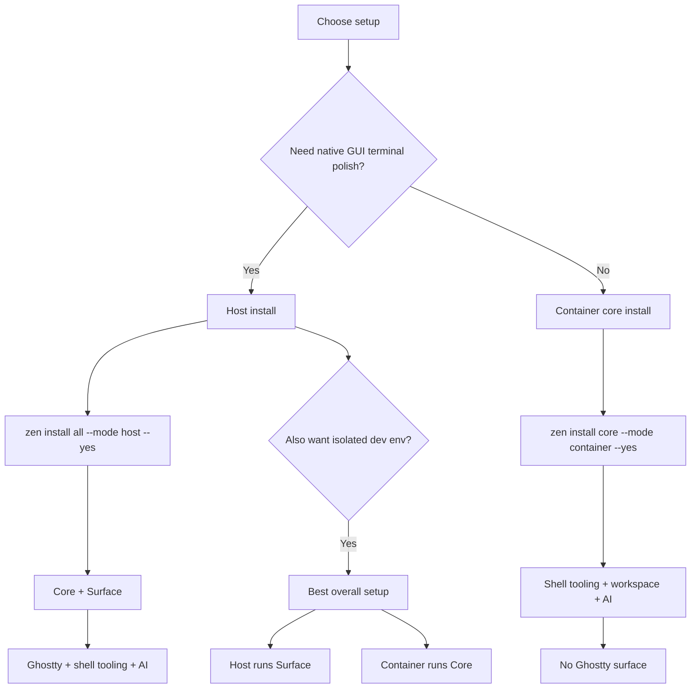
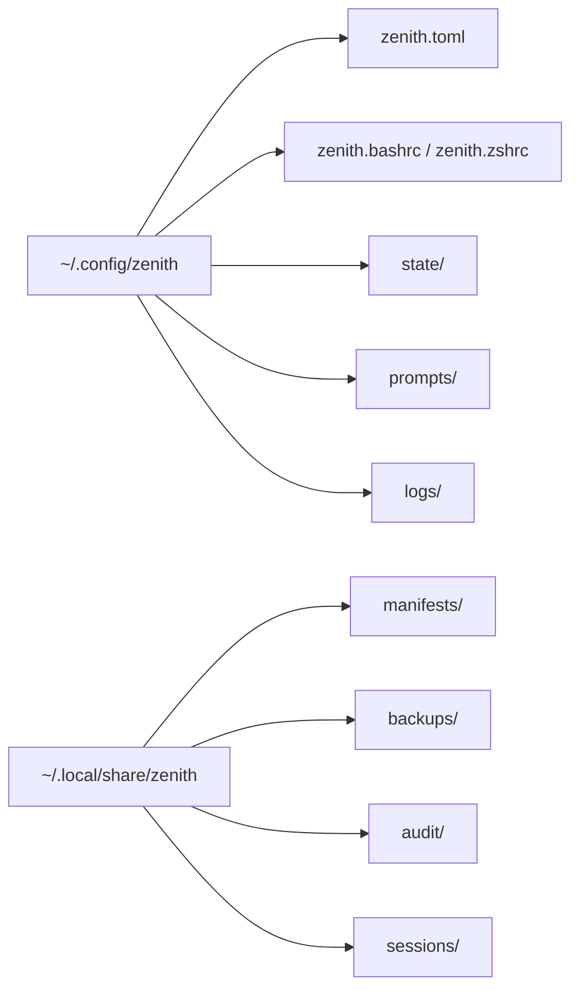
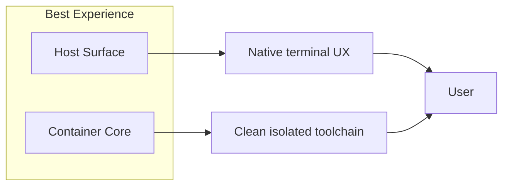

# Zenith Architecture

Zenith works best when you think about it as two products that share one CLI:

- `core`: portable shell/runtime features
- `surface`: host-native terminal UX

GitHub and VS Code both render the Mermaid diagrams below, so this file is the visual architecture reference.

## 1. Product split

## 2. Mental model

This is the intended split:

- Host: visual terminal experience
- Container: isolated tool/runtime experience
- Shared state: Zenith config, manifests, backups, prompts

## 3. Runtime flow

## 4. Install paths

## 5. Files by responsibility

### User-facing entrypoints
- `zenith.sh`: local repo bootstrap wrapper
- `bin/zen`: CLI script entrypoint
- `src/zenith/cli.py`: command router

### Install and lifecycle
- `src/zenith/install.py`: installs `core` and `surface`
- `src/zenith/manifest.py`: transaction history
- `src/zenith/rollback.py`: rollback and uninstall
- `src/zenith/backup.py`: file backup helpers

### Environment and health
- `src/zenith/detect.py`: host/container/runtime detection
- `src/zenith/status.py`: user-facing status output
- `src/zenith/doctor.py`: health checks
- `src/zenith/paths.py`: XDG and state paths

### Runtime features
- `src/zenith/workspace.py`: Zellij session handling
- `src/zenith/ai.py`: `nav` and `fix`
- `src/zenith/surface.py`: orbit/surface behavior
- `src/zenith/shells.py`: bash/zsh integration points

### Assets and config
- `src/zenith/assets/`: packaged prompts and shell/config assets
- `configs/`: source config assets in the repo
- `prompts/`: editable prompt source files

## 6. State layout

## 7. Recommended usage

If you only remember one picture, remember this:

Best practical choices:

- Want the nicest terminal UX: use host `surface`
- Want isolation and resettable tooling: use container `core`
- Want the strongest overall setup: host `surface` plus container `core`
